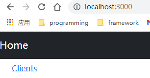
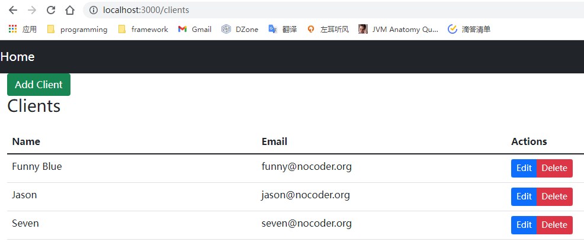

# react-springboot-crud

CRUD Application With React and Spring Boot

1. generate springboot project from [start.spring.io](https://start.spring.io/).
2. add dependencies to pom.xml file.
3. create the Model, Repository, Controller.
4. add some `clients` using postman.

5. create `react` app in spring boot application base directory, named `frontend`
    
   ```shell
    npx create-react-app frontend
    ```
   
    install bootstrap, react router and reactstrap in the frontend directory.

    ```shell
    npm install --save bootstrap@5.1 react-cookie@4.1.1 react-router-dom@5.3.0 reactstrap@8.10.0
    ```
6. run `ReactSpringbootCrudApplication.java` to start the springboot project.
7. run `npm start` to start the frontend app.
8. visit `http://localhost:3000`, then we can see the demo.

   

   